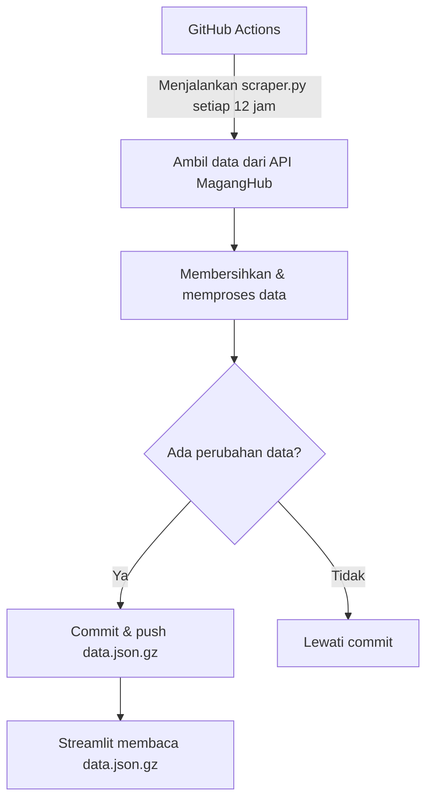

---
# 📊 Data Lowongan Magang — KEMNAKER

Aplikasi ini merupakan proyek **otomatisasi scraping dan visualisasi data lowongan magang** dari portal resmi
[MagangHub KEMNAKER](https://maganghub.kemnaker.go.id).
Data diambil secara berkala menggunakan GitHub Actions, diproses, dikompresi, dan ditampilkan melalui aplikasi **Streamlit** yang interaktif.
---

## 📁 Struktur Proyek

```
├── app.py                 # Aplikasi Streamlit untuk menampilkan data lowongan
├── scraper.py             # Script utama untuk scraping dan pembersihan data
├── scraper.ipynb          # Notebook eksplorasi / debugging manual
├── requirements.txt       # Daftar dependensi Python
├── data.json.gz           # Data lowongan magang terkini (terkompres)
├── raw_data.json.gz       # Data mentah hasil scraping (terkompres)
└── .github/
    └── workflows/
        └── scrape.yaml    # GitHub Actions untuk scraping otomatis setiap 12 jam
```

---

## ⚙️ Fitur Utama

### 🕷️ Scraper Otomatis (`scraper.py`)

- Mengambil seluruh data lowongan magang aktif dari API publik KEMNAKER.
- Menggunakan **ThreadPoolExecutor** untuk mempercepat proses pengambilan data multi-halaman.
- Melakukan **pembersihan dan normalisasi data**:
  - Mengurai kolom nested seperti `perusahaan`, `program_studi`, dan `jenjang`.
  - Menghapus duplikat dan kolom kosong.
  - Menambahkan kolom tambahan seperti `diff_quota` (sisa kuota).
- Menyimpan hasil dalam format:
  - `raw_data.json.gz` → data mentah hasil scraping.
  - `data.json.gz` → data bersih siap pakai untuk aplikasi Streamlit.

### 🌐 Aplikasi Visualisasi (`app.py`)

- Menampilkan data hasil scraping dalam tabel interaktif dengan **Streamlit**.
- Dilengkapi dengan fitur:
  - Filter berdasarkan **provinsi**, **kabupaten**, dan **pencarian posisi/perusahaan**.
  - Sorting kolom dinamis.
  - Pagination (navigasi antar halaman data).
  - Tombol unduh CSV hasil filter.
- Data ditampilkan secara real-time dari file `data.json.gz`.

### 🤖 Automasi dengan GitHub Actions (`.github/workflows/scrape.yaml`)

- Scraper dijalankan otomatis **setiap 12 jam**.
- Menyimpan hasil scraping terbaru ke repository.
- Menggunakan caching `pip` agar instalasi dependensi lebih cepat.
- Hanya melakukan commit ketika ada perubahan data.
- Menambahkan timestamp pada pesan commit untuk kejelasan versi data.

---

## 🚀 Menjalankan Proyek Secara Lokal

### 1. Kloning Repository

```bash
git clone https://github.com/malifnasrulloh/scrape-maganghub.git
cd scrape-maganghub
```

### 2. Buat Virtual Environment

```bash
python -m venv venv
source venv/bin/activate     # (Linux/Mac)
venv\Scripts\activate        # (Windows)
```

### 3. Instal Dependensi

```bash
pip install -r requirements.txt
```

### 4. Jalankan Scraper (opsional)

```bash
python scraper.py
```

### 5. Jalankan Aplikasi Streamlit

```bash
streamlit run app.py
```

---

## 📦 Format Data

| Kolom                      | Deskripsi                                                   |
| -------------------------- | ----------------------------------------------------------- |
| `posisi`                   | Nama posisi magang                                          |
| `perusahaan`               | Nama perusahaan / instansi penyedia                         |
| `government_agency`        | Instansi pemerintah terkait (jika ada)                      |
| `sub_government_agency`    | Sub-instansi terkait                                        |
| `program_studi`            | Program studi yang relevan                                  |
| `jenjang`                  | Jenjang pendidikan yang diterima                            |
| `jumlah_kuota`             | Jumlah kuota magang yang tersedia                           |
| `jumlah_terdaftar`         | Jumlah peserta yang telah mendaftar                         |
| `diff_quota`               | Selisih kuota tersisa (`jumlah_kuota` - `jumlah_terdaftar`) |
| `kabupaten`, `provinsi`    | Lokasi magang                                               |
| `created_at`, `updated_at` | Waktu pembuatan dan pembaruan data                          |

---

## 🧠 Arsitektur Otomasi



---

## 🛠️ Tips & Optimisasi

- Gunakan **GZIP** untuk menghemat ukuran file data besar.
- Hindari `eval()` sembarangan — gunakan `json.loads()` bila memungkinkan.
- Pastikan file `data.json.gz` < 100 MB agar tidak ditolak GitHub.
- Workflow menggunakan caching pip (`actions/cache`) untuk mempercepat CI/CD.
- Timestamps pada commit memudahkan audit waktu scraping terakhir.

---

## 🔒 Keamanan

- Tidak menggunakan API Key — seluruh data bersifat **publik**.
- File data di-_commit_ langsung ke repo, tanpa koneksi eksternal tambahan.
- Penanganan error jaringan dan parsing dilakukan secara aman dengan `try/except`.

---

## 📅 Jadwal Pembaruan Otomatis

GitHub Actions dijadwalkan untuk berjalan:

```
0 */12 * * *
```

Artinya: **Setiap 12 jam sekali** (dua kali sehari) akan melakukan scraping otomatis dan memperbarui file `data.json.gz` jika ada data baru.

---

## 📄 Lisensi

Proyek ini bersifat **open-source** dan dapat digunakan untuk penelitian, pengembangan, atau visualisasi data publik.
Pastikan mencantumkan sumber data resmi:

> [https://maganghub.kemnaker.go.id](https://maganghub.kemnaker.go.id)

---

## 👨‍💻 Kontributor

| Nama                        | Peran                                     |
| --------------------------- | ----------------------------------------- |
| **Muhammad Alif Nasrulloh** | Pengembang utama, scraper & Streamlit app |
| GitHub Actions              | Otomasi dan deployment data               |

---

**Made with ❤️ and Python.**
_Data diambil dari sumber publik Kementerian Ketenagakerjaan RI._

---
